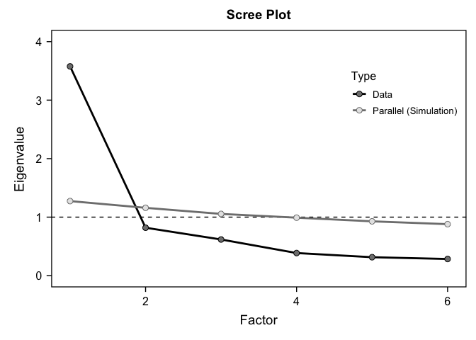

Lab9
================
Jo Starenky
2024-11-14

``` r
library(tidyverse)
```

    ## ── Attaching core tidyverse packages ──────────────────────── tidyverse 2.0.0 ──
    ## ✔ dplyr     1.1.4     ✔ readr     2.1.5
    ## ✔ forcats   1.0.0     ✔ stringr   1.5.1
    ## ✔ ggplot2   3.5.1     ✔ tibble    3.2.1
    ## ✔ lubridate 1.9.3     ✔ tidyr     1.3.1
    ## ✔ purrr     1.0.2     
    ## ── Conflicts ────────────────────────────────────────── tidyverse_conflicts() ──
    ## ✖ dplyr::filter() masks stats::filter()
    ## ✖ dplyr::lag()    masks stats::lag()
    ## ℹ Use the conflicted package (<http://conflicted.r-lib.org/>) to force all conflicts to become errors

``` r
library(bruceR)
```

    ## 
    ## bruceR (v2024.6)
    ## Broadly Useful Convenient and Efficient R functions
    ## 
    ## Packages also loaded:
    ## ✔ data.table ✔ emmeans
    ## ✔ dplyr      ✔ lmerTest
    ## ✔ tidyr      ✔ effectsize
    ## ✔ stringr    ✔ performance
    ## ✔ ggplot2    ✔ interactions
    ## 
    ## Main functions of `bruceR`:
    ## cc()             Describe()  TTEST()
    ## add()            Freq()      MANOVA()
    ## .mean()          Corr()      EMMEANS()
    ## set.wd()         Alpha()     PROCESS()
    ## import()         EFA()       model_summary()
    ## print_table()    CFA()       lavaan_summary()
    ## 
    ## For full functionality, please install all dependencies:
    ## install.packages("bruceR", dep=TRUE)
    ## 
    ## Online documentation:
    ## https://psychbruce.github.io/bruceR
    ## 
    ## To use this package in publications, please cite:
    ## Bao, H.-W.-S. (2024). bruceR: Broadly useful convenient and efficient R functions (Version 2024.6) [Computer software]. https://CRAN.R-project.org/package=bruceR
    ## 
    ## 
    ## These packages are dependencies of `bruceR` but not installed:
    ## - pacman, openxlsx, ggtext, lmtest, vars, phia, MuMIn, GGally
    ## 
    ## ***** Install all dependencies *****
    ## install.packages("bruceR", dep=TRUE)

``` r
library(haven)


lab9data<-read_sav("/Users/jostarenky/Documents/GitHub/Lab9/lab9data.sav")
```

<https://www.neellab.ca/uploads/1/2/1/1/121173522/the_fundamental_social_motives_inventory.pdf>

# Reliability

``` r
#Option 1: 
#The traditional way is to recode your items first, then use the recoded items to test reliability

lab9data$FSMI3_R <- 8 - lab9data$FSMI3
lab9data$FSMI57_R <- 8 - lab9data$FSMI57
lab9data$FSMI58_R <- 8 - lab9data$FSMI58

#If you use the unrecoded items, it will mess up the Cronbach's alpha and lead you to draw wrong conclusion

Alpha(lab9data, "FSMI", c("1", "2", "3_R", "4", "5", "6"))
```

    ## 
    ## Reliability Analysis
    ## 
    ## Summary:
    ## Total Items: 6
    ## Scale Range: 1 ~ 7
    ## Total Cases: 300
    ## Valid Cases: 297 (99.0%)
    ## 
    ## Scale Statistics:
    ## Mean = 4.535
    ## S.D. = 1.318
    ## Cronbach’s α = 0.873
    ## McDonald’s ω = 0.887
    ## 
    ## Item Statistics (Cronbach’s α If Item Deleted):
    ## ──────────────────────────────────────────────────
    ##           Mean    S.D. Item-Rest Cor. Cronbach’s α
    ## ──────────────────────────────────────────────────
    ## FSMI1    4.148 (1.722)          0.776        0.833
    ## FSMI2    4.943 (1.468)          0.729        0.845
    ## FSMI3_R  4.512 (1.835)          0.367        0.906
    ## FSMI4    4.185 (1.848)          0.749        0.838
    ## FSMI5    4.458 (1.696)          0.791        0.831
    ## FSMI6    4.966 (1.500)          0.708        0.847
    ## ──────────────────────────────────────────────────
    ## Item-Rest Cor. = Corrected Item-Total Correlation

``` r
#Option 2:
#If you don't want to recode your variable, you can use the shortcut below
Alpha(lab9data, "FSMI", 1:6, rev = 3)
```

    ## 
    ## Reliability Analysis
    ## 
    ## Summary:
    ## Total Items: 6
    ## Scale Range: 1 ~ 7
    ## Total Cases: 300
    ## Valid Cases: 297 (99.0%)
    ## 
    ## Scale Statistics:
    ## Mean = 4.535
    ## S.D. = 1.318
    ## Cronbach’s α = 0.873
    ## McDonald’s ω = 0.887
    ## 
    ## Item Statistics (Cronbach’s α If Item Deleted):
    ## ──────────────────────────────────────────────────────
    ##               Mean    S.D. Item-Rest Cor. Cronbach’s α
    ## ──────────────────────────────────────────────────────
    ## FSMI1        4.148 (1.722)          0.776        0.833
    ## FSMI2        4.943 (1.468)          0.729        0.845
    ## FSMI3 (rev)  4.512 (1.835)          0.367        0.906
    ## FSMI4        4.185 (1.848)          0.749        0.838
    ## FSMI5        4.458 (1.696)          0.791        0.831
    ## FSMI6        4.966 (1.500)          0.708        0.847
    ## ──────────────────────────────────────────────────────
    ## Item-Rest Cor. = Corrected Item-Total Correlation

# Exploratory Factor Analysis

``` r
#In factor analysis, using reverse scored items or not does not make a difference in interpretation. If you use unrecoded items, it will just make the loadings negative

EFA(lab9data, "FSMI", 1:6, rev = 3, method = "pa", plot.scree = TRUE, nfactors = c("parallel"))
```

    ## 
    ## Explanatory Factor Analysis
    ## 
    ## Summary:
    ## Total Items: 6
    ## Scale Range: 1 ~ 7
    ## Total Cases: 300
    ## Valid Cases: 297 (99.0%)
    ## 
    ## Extraction Method:
    ## - Principal Axis Factor Analysis
    ## Rotation Method:
    ## - (Only one component was extracted. The solution was not rotated.)
    ## 
    ## KMO and Bartlett's Test:
    ## - Kaiser-Meyer-Olkin (KMO) Measure of Sampling Adequacy: MSA = 0.875
    ## - Bartlett's Test of Sphericity: Approx. χ²(15) = 1006.50, p < 1e-99 ***
    ## 
    ## Total Variance Explained:
    ## ───────────────────────────────────────────────────────────────────────────────
    ##           Eigenvalue Variance % Cumulative % SS Loading Variance % Cumulative %
    ## ───────────────────────────────────────────────────────────────────────────────
    ## Factor 1       3.827     63.786       63.786      3.470     57.834       57.834
    ## Factor 2       0.833     13.883       77.669                                   
    ## Factor 3       0.532      8.871       86.540                                   
    ## Factor 4       0.306      5.105       91.645                                   
    ## Factor 5       0.277      4.621       96.266                                   
    ## Factor 6       0.224      3.734      100.000                                   
    ## ───────────────────────────────────────────────────────────────────────────────
    ## 
    ## Factor Loadings (Sorted by Size):
    ## ──────────────────────────────
    ##                PA1 Communality
    ## ──────────────────────────────
    ## FSMI5        0.868       0.754
    ## FSMI1        0.844       0.712
    ## FSMI4        0.801       0.641
    ## FSMI2        0.788       0.621
    ## FSMI6        0.771       0.594
    ## FSMI3 (rev)  0.384       0.147
    ## ──────────────────────────────
    ## Communality = Sum of Squared (SS) Factor Loadings
    ## (Uniqueness = 1 - Communality)

<!-- --> \# Now test
reliability for the status seeking subscale

``` r
lab9data$FSMI3_R <- 36 - lab9data$FSMI3
Alpha(lab9data, "FSMI", 31:36, rev = 36)
```

    ## 
    ## Reliability Analysis
    ## 
    ## Summary:
    ## Total Items: 6
    ## Scale Range: 1 ~ 7
    ## Total Cases: 300
    ## Valid Cases: 296 (98.7%)
    ## 
    ## Scale Statistics:
    ## Mean = 3.781
    ## S.D. = 1.246
    ## Cronbach’s α = 0.830
    ## McDonald’s ω = 0.840
    ## 
    ## Item Statistics (Cronbach’s α If Item Deleted):
    ## ───────────────────────────────────────────────────────
    ##                Mean    S.D. Item-Rest Cor. Cronbach’s α
    ## ───────────────────────────────────────────────────────
    ## FSMI31        3.473 (1.733)          0.715        0.778
    ## FSMI32        3.686 (1.885)          0.628        0.798
    ## FSMI33        3.878 (1.673)          0.736        0.775
    ## FSMI34        3.713 (1.649)          0.701        0.782
    ## FSMI35        4.807 (1.603)          0.549        0.813
    ## FSMI36 (rev)  3.128 (1.602)          0.302        0.858
    ## ───────────────────────────────────────────────────────
    ## Item-Rest Cor. = Corrected Item-Total Correlation

# Q1: What is the Cronbach’s alpha of this subscale? Is it a reliable measure of status seeking? Why?

The Cronbach’s alpha of this scale is 0.83, which means it is a reliable
measure of status seeking because a Cronbach’s alpha above 0.7 is
considered “acceptable”, and over 0.8 is considered “good”

# Now run a factor analysis on the Mate Retention (Breakup Concern) subscale

``` r
EFA(lab9data, "FSMI", 49:54, method = "pa", plot.scree = TRUE, nfactors = c("parallel"))
```

    ## 
    ## Explanatory Factor Analysis
    ## 
    ## Summary:
    ## Total Items: 6
    ## Scale Range: 1 ~ 7
    ## Total Cases: 300
    ## Valid Cases: 206 (68.7%)
    ## 
    ## Extraction Method:
    ## - Principal Axis Factor Analysis
    ## Rotation Method:
    ## - (Only one component was extracted. The solution was not rotated.)
    ## 
    ## KMO and Bartlett's Test:
    ## - Kaiser-Meyer-Olkin (KMO) Measure of Sampling Adequacy: MSA = 0.905
    ## - Bartlett's Test of Sphericity: Approx. χ²(15) = 1434.86, p < 1e-99 ***
    ## 
    ## Total Variance Explained:
    ## ───────────────────────────────────────────────────────────────────────────────
    ##           Eigenvalue Variance % Cumulative % SS Loading Variance % Cumulative %
    ## ───────────────────────────────────────────────────────────────────────────────
    ## Factor 1       5.015     83.578       83.578      4.823     80.378       80.378
    ## Factor 2       0.386      6.436       90.014                                   
    ## Factor 3       0.213      3.549       93.563                                   
    ## Factor 4       0.153      2.548       96.111                                   
    ## Factor 5       0.139      2.313       98.424                                   
    ## Factor 6       0.095      1.576      100.000                                   
    ## ───────────────────────────────────────────────────────────────────────────────
    ## 
    ## Factor Loadings (Sorted by Size):
    ## ─────────────────────────
    ##           PA1 Communality
    ## ─────────────────────────
    ## FSMI51  0.940       0.883
    ## FSMI52  0.928       0.861
    ## FSMI50  0.899       0.809
    ## FSMI49  0.893       0.797
    ## FSMI54  0.892       0.795
    ## FSMI53  0.823       0.678
    ## ─────────────────────────
    ## Communality = Sum of Squared (SS) Factor Loadings
    ## (Uniqueness = 1 - Communality)

<!-- -->

# Q2: How many factors can you identify from the results? Based on what? What is the range of the factor loadings? What is item that has the highest factor loading? In conclusion, is this a good measure of break up concern and why?

We can only identify one factor from the results, because there is only
one point on the scree plot that is above the flattened point and
simulated data, and the Eigenvalue is greater than 1. The range of the
factor loadings is between 0.823 - 0.940, and FSMI51 has the highest
factor loading. This subscale is a good measure of breakup concern
because all of the factor loadings are above 0.4, and this one factor
can explain 84% of the variance in the items.

# Q3: Pick another subscale from FSMI. Test reliability and factor analysis. Answer all the questions above.

\#Testing reliability for Affiliation (Independence) subscale

``` r
Alpha(lab9data, "FSMI", 25:30)
```

    ## 
    ## Reliability Analysis
    ## 
    ## Summary:
    ## Total Items: 6
    ## Scale Range: 1 ~ 7
    ## Total Cases: 300
    ## Valid Cases: 292 (97.3%)
    ## 
    ## Scale Statistics:
    ## Mean = 5.010
    ## S.D. = 1.264
    ## Cronbach’s α = 0.858
    ## McDonald’s ω = 0.865
    ## 
    ## Item Statistics (Cronbach’s α If Item Deleted):
    ## ─────────────────────────────────────────────────
    ##          Mean    S.D. Item-Rest Cor. Cronbach’s α
    ## ─────────────────────────────────────────────────
    ## FSMI25  4.627 (1.769)          0.734        0.818
    ## FSMI26  4.373 (1.818)          0.699        0.825
    ## FSMI27  4.702 (1.814)          0.503        0.864
    ## FSMI28  5.503 (1.509)          0.633        0.838
    ## FSMI29  5.579 (1.418)          0.597        0.844
    ## FSMI30  5.277 (1.534)          0.759        0.816
    ## ─────────────────────────────────────────────────
    ## Item-Rest Cor. = Corrected Item-Total Correlation

# Q1: What is the Cronbach’s alpha of this subscale? Is it a reliable measure of status seeking? Why?

The Cronbach’s alpha of this scale is 0.86, which means it is a reliable
measure of status seeking because a Cronbach’s alpha above 0.7 is
considered “acceptable”, and over 0.8 is considered “good”

``` r
EFA(lab9data, "FSMI", 25:30, method = "pa", plot.scree = TRUE, nfactors = c("parallel"))
```

    ## 
    ## Explanatory Factor Analysis
    ## 
    ## Summary:
    ## Total Items: 6
    ## Scale Range: 1 ~ 7
    ## Total Cases: 300
    ## Valid Cases: 292 (97.3%)
    ## 
    ## Extraction Method:
    ## - Principal Axis Factor Analysis
    ## Rotation Method:
    ## - (Only one component was extracted. The solution was not rotated.)
    ## 
    ## KMO and Bartlett's Test:
    ## - Kaiser-Meyer-Olkin (KMO) Measure of Sampling Adequacy: MSA = 0.847
    ## - Bartlett's Test of Sphericity: Approx. χ²(15) = 797.97, p < 1e-99 ***
    ## 
    ## Total Variance Explained:
    ## ───────────────────────────────────────────────────────────────────────────────
    ##           Eigenvalue Variance % Cumulative % SS Loading Variance % Cumulative %
    ## ───────────────────────────────────────────────────────────────────────────────
    ## Factor 1       3.577     59.616       59.616      3.131     52.181       52.181
    ## Factor 2       0.819     13.653       73.269                                   
    ## Factor 3       0.618     10.299       83.568                                   
    ## Factor 4       0.386      6.437       90.005                                   
    ## Factor 5       0.315      5.250       95.255                                   
    ## Factor 6       0.285      4.745      100.000                                   
    ## ───────────────────────────────────────────────────────────────────────────────
    ## 
    ## Factor Loadings (Sorted by Size):
    ## ─────────────────────────
    ##           PA1 Communality
    ## ─────────────────────────
    ## FSMI30  0.846       0.716
    ## FSMI25  0.802       0.644
    ## FSMI26  0.750       0.563
    ## FSMI28  0.689       0.475
    ## FSMI29  0.669       0.448
    ## FSMI27  0.534       0.285
    ## ─────────────────────────
    ## Communality = Sum of Squared (SS) Factor Loadings
    ## (Uniqueness = 1 - Communality)

<!-- --> \# Q2: How many
factors can you identify from the results? Based on what? What is the
range of the factor loadings? What is item that has the highest factor
loading? In conclusion, is this a good measure of break up concern and
why?

We can only identify one factor from the results, because there is only
one point on the scree plot that is above the flattened point and
simulated data, and the Eigenvalue is greater than 1. The range of the
factor loadings is between 0.534 - 0.846, and FSMI30 has the highest
factor loading. This subscale is a good measure of breakup concern
because all of the factor loadings are above 0.4, and this one factor
can explain 60% of the variance in the items.
